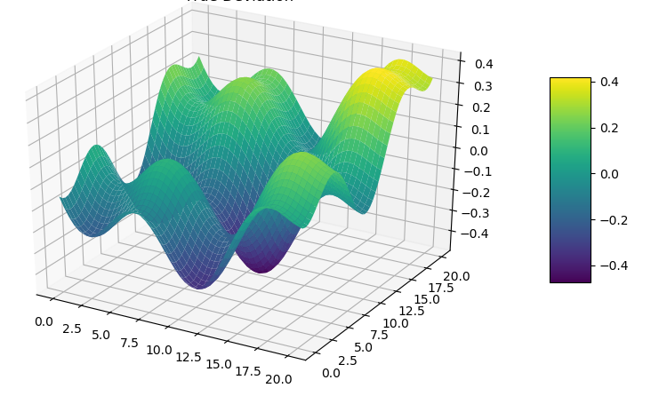

# PROJECT TITLE 

## NON-TECHNICAL EXPLANATION OF YOUR PROJECT
This model takes a dataset comprising a set of people whom may of may not have diabities. A number of features are also present oncluding BMI, heart disease condition and blood glucose level. Metrics are evaluated, features are analysed and a model to predict disease status created 

## DATA
The dataset came from the data science website kaggle. 

## MODEL 
I used a random forest for both feature importance and predictin. These are powerful predictors. 

## HYPERPARAMETER OPTIMSATION
I used a gridsearch approach to optimise parameters such as tree depth.

## RESULTS
The result gave a high value of 0.95 AUC.

You can include images of plots using the code below:

## (OPTIONAL: CONTACT DETAILS)
If you are planning on making your github repo public you may wish to include some contact information such as a link to your twitter or an email address. 

